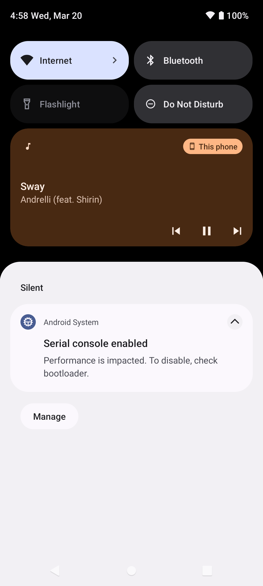

# MusicPlayer
Jest to prosta aplikacja do odtwarzania muzyki na Androida opracowana w Javie przy użyciu Android Studio. 
# Funkcje 
* Odtwarzanie plików muzycznych zapisanych na urządzeniu 
* Wstrzymywanie, pomijanie i powtarzanie utworów 
* Sterowanie w aplikacji jak i w powiadomieniach
* Funkcja ponownego odtwarzania 
* Minimalistyczny interfejs użytkownika 
# Zrzuty ekranu 

# Instalacja 
Aby uruchomić tę aplikację, możesz pobrać kod źródłowy i zaimportować go do Android Studio. Upewnij się, że masz zainstalowane niezbędne narzędzia Android SDK. Zwyczaj Po zainstalowaniu aplikacji na urządzeniu z Androidem możesz ją otworzyć i rozpocząć odtwarzanie plików muzycznych zapisanych na urządzeniu. Użyj elementów sterujących na ekranie, aby zarządzać odtwarzaniem.
